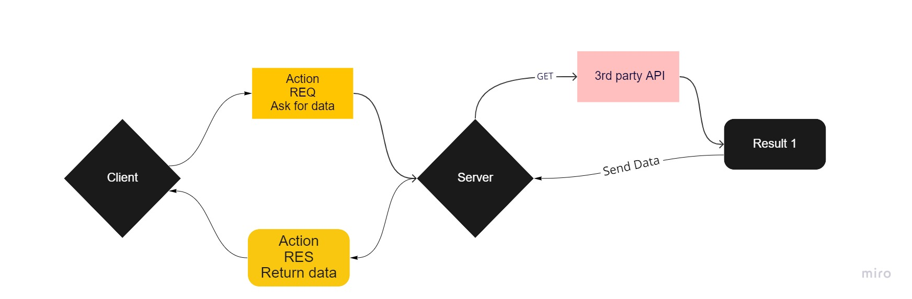
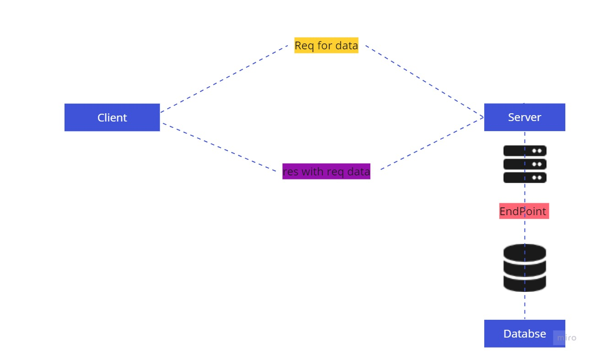

# Movies-Library - V1

**Author Name**: Muhammad.Q.Tarboush

## WRRC

Web Request Response Cycle with 3th party api

Web Request Response Cycle with SQL DB

## Overview

a movie app that can check the latest movies based on categories

## Getting Started

This project build with:

- Node.js
- Express.js
- 3th Party API - The Movie DB
- Postgres DB

Before starting type into your terminal:

> npm install

After its done:
> npm start
will work in port 3000

## Project Features

We have the following routes :

- / , will lead you to the move object
- /favorite , for your favorites movies
- /err , for testing errors "dev purpose"
- /search , Search for a movie name to get its information
- /trending, Get the trending movies data from the Movie DB API
- /tv , Get the list of official genres for TV shows.
- /changes,Get a list of all of the movie ids that have been changed in the past 24 hours
- /addMovie , Store the movie into our database
- /getMovies, Get all movies stored into database
- /getMovie/id, Get one movie stored into database
- /updateMovie/id , will update the movie into our database
- /deleteMovie/id, will delete the movie from our database
