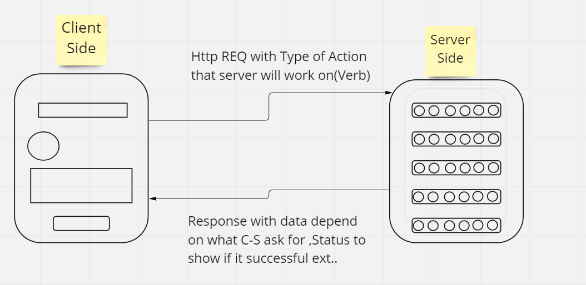

# Movies-Library - V1

**Author Name**: Muhammad.Q.Tarboush

## WRRC

## Overview

a movie app that can check the latest movies based on categories

## Getting Started

Before starting type into your terminal:

> npm install

After its done:
> npm start
will work in port 3000

## Project Features

We have the following routes :

- / , will lead you to the move object
- /favorite , for your favorites movies
- /err , for testing errors "dev purpose"
